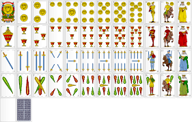

  

# Parcial 1 - "MAYOR/MENOR"

Se pide construir una aplicación de consolas en Java que permita a una persona 
jugar al popular juego de cartas del solitario mayor/menor en el que el jugador 
va dando vuelta cartas de un mazo y debe adivinar si la siguiente es mayor o 
menor. La aplicación debe cumplir con los siguientes requisitos:

1. La aplicación debe iniciar con un mensaje de bienvenida y pedir el nombre del jugador. 
2. La aplicación debe utilizar una baraja de 40 cartas españolas y mezclarla al inicio del juego. 
3. La aplicación debe mostrar la primera carta de la baraja y pedir al jugador que adivine si la siguiente carta es mayor o menor que la actual. 
4. Si el jugador adivina correctamente, la aplicación debe mostrar la siguiente carta y pedir otra adivinanza. Si el jugador adivina incorrectamente, el juego debe terminar y debe mostrar un mensaje que indique que el jugador ha perdido. Si la carta tiene el mismo valor, se la considerará correcta. 
5. La aplicación debe ser tolerante a errores por parte del usuario al momento de ingresar los datos. El juego debe continuar hasta que el jugador adivine incorrectamente o hasta que llegue al final de la baraja de cartas. 
6. Se debe llevar un registro de la cantidad de cartas adivinadas correctamente por el jugador, cuántas quedan en el mazo y mostrarlo cada vez que voltea una carta. 
7. La aplicación debe permitir al jugador jugar otra partida si lo desea, y si se juega otra partida, la baraja debe ser mezclada de nuevo. 
8. La aplicación debe llevar un registro de cuantas partidas ganó y cuantas perdió el jugador durante una misma ejecución de la aplicación. 
9. Si el jugador decide no volver a jugar, debe mostrar por pantalla cuantas partidas ganó, cuantas perdió y un mensaje de despedida.

La aplicación debe estar construida utilizando programación orientada a 
objetos usando Java y debe utilizar un enfoque modular. La lógica del 
juego debe estar separada de la lógica de presentación. Se deben escribir 
Test que validen la solución implementada (Al menos se deben desarrollar 
los Test de un método público y uno privado, contemplando sus límites)
